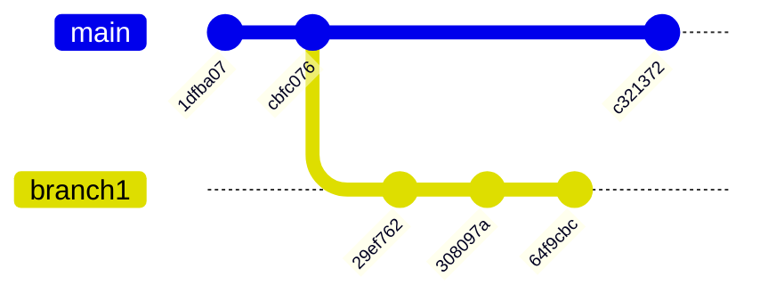
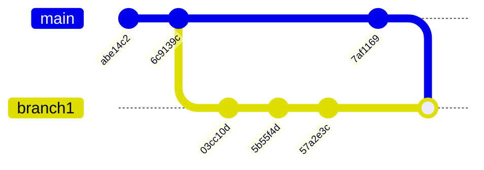

# gitの練習

## はじめに

gitで作業者として作業してるとプルリクエストは作業結果を提出する大事な場所という認識だと思う。
しかし、一方で作業の履歴をバンバン取っていけるのもgitの醍醐味
これらを両立させるためにはgitにある程度習熟する必要がある。
特に、ブランチのマージや、複数コミットの単一化、作業ブランチの意味等を理解せずにgitを使うことは作業効率が落ちかえって害悪に近い。
`git stash` でバックアップを取りながらの作業はその後の`stash pop`等で苦労した人も多いことだと思う。
せめて、第４問までやることで `git stash` が不要になる。

この練習環境は、以上を習熟するための一歩となることを願い作成した。

また、これを見た誰でも、問題を作ってPRしてくれるのは大歓迎である。

## 必要技能

- コマンド入力
- viの操作(４問以降の`rebase -i`時等に必要）

## 環境

- 起動 `docker-compose run --rm ubuntu bash`
- 削除 `docker-compose down -v --remove-orphans`

- `ubuntu`フォルダに `.bashrc` と `.gitconfig` を置いてあるので自分の環境に持ってくるときには参考になる


## 練習問題の実行の仕方

```sh
docker-compose build
docker-compose run --rm ubuntu zsh
```
`./mkproblem.sh` で問題を作成（何度も実行でき、問題をリセットする）


した後、下記で問題用のフォルダ(repo1〜)に移る

```sh
cd /src/practice/repo1
```


## 終了時

volumeごと削除

```sh
docker-compose down -v --remove-orphans
```


## 第1問

### 想定

- 最後のコミットのコメントを間違えた

### 問題

- 最後のコミットを`B->2`にせよ

#### 前

```sh
$ git log --oneline
a0bb8c3 (HEAD -> branch1) C->2
2ed3553 A->1
84425f3 append ABCD
c5ea033 initial commit
```

#### 後

```sh
$ git log --oneline
74dc31e (HEAD -> branch1) B->2
2ed3553 A->1
84425f3 append ABCD
c5ea033 initial commit
```

### 解答

- `--amend` すればいい

```sh
$ git commit --amend -m "B->2"
```

## 第2問

### 想定

- masterが先に進んでしまった、mergeでmasterを取り込もう

### 問題

- branch1にmasterをマージせよ

#### 前

```sh
$ git log --oneline --all --graph
* 64f9cbc (HEAD -> branch1) 1->10
* 308097a B->2
* 29ef762 A->1
| * c321372 (master) D->4
|/
* cbfc076 append ABCD
* 1dfba07 initial commit
```



#### 後

```sh
$ git log --oneline --all --graph
*   dbeb5cb (HEAD -> branch1) masterをマージ
|\
| * 7af1169 (master) D->4
* | 57a2e3c 1->10
* | 5b55f4d B->2
* | 03cc10d A->1
|/
* 6c9139c append ABCD
* abe14c2 initial commit
```


```

### 解答

```sh
$ git merge master -m "masterをマージ"
```

- マージではmasterで枝が分岐しているので見にくい（ちょっとかっこ悪い）
- コンフリクト起こしてたりすると運用が結構大変

## 第3問

### 想定

- 提出するときにはコンフリクトをなるべく避けるために最新masterより後にコミットを集めたい

### 問題

#### 前

```sh
$ git log --oneline --all --graph --date-order
* cae5446 (HEAD -> branch1) 1->10
| * ad43843 (master) D->4
* | 3eae60e B->2
* | d0be2fd A->1
|/
* 52003c2 append ABCD
* 133d817 initial commit
```

#### 後

```sh
$ git log --oneline --all --graph --date-order
* cb2db88 (HEAD -> branch1) 1->10
* fd94194 B->2
* 167fc99 A->1
* ad43843 (master) D->4
* 52003c2 append ABCD
* 133d817 initial commit
```

### 解答

```sh
$ git rebase master
```

- rebaseすると一直線で気持ち良い
- でも提出する（＝プルリクエスト作成）ときにコミット細切れでかっこ悪い

## 第4問

### 想定

- コミットがバラバラの作業のバックアップをしたい
- rebaseするブランチがコンフリクトの解消等でぐちゃぐちゃになってしまい捨てる等担ったときのためにバックアップのブランチ(branch2)を作りたい
- master後のコミットを一つにまとめたい

### 問題

#### 前

```sh
$ git log --oneline --all --graph --date-order
* 3759c20 (HEAD -> branch1) 1->10
| * 7d7edb8 (master) D->4
* | 7287808 B->2
* | 0c010df A->1
|/
* 56cfe5a append ABCD
* fca0fb9 initial commit
```

#### 後

```sh
$ git log --oneline --all --graph --date-order
* 8b22b6f (HEAD -> branch1) 一つのコミット
| * 3759c20 (branch2) 1->10
* | 7d7edb8 (master) D->4
| * 7287808 B->2
| * 0c010df A->1
|/
* 56cfe5a append ABCD
* fca0fb9 initial commit
```

### 解答

```sh
$ git checkout -b branch2
$ git checkout branch1
$ git rebase master
$ git reset master
$ git add .
$ git commit -m "一つのコミット"
```

- rebase後に masterの位置でソフトリセットかけることで、
- 最新のソースが手元にあり、masterとの差分をコミットすれば要件は満たされる。
- そのへんの`git reset`の説明にはろくなものがなく、**コミットメッセージを破棄してまとめる**ときはこれが一番手頃。
- バックアップであるbranch2が不要なら `git branch -D branch2` で破棄する


## 第5問

### 想定

- masterが修正されてしまい先に進んでしまった。
- master修正前のコミット、修正後のコミットをそれぞれまとめてmaster後のコミットとしたい

### 問題

#### 前

```sh
$ git log --oneline --all --graph --date-order
* 974af62 (HEAD -> branch1) 1->10
| * d2dace8 (master) D->4
* | 5a14454 B->2
* | 761157e A->1
|/
* 7db73c5 append ABCD
* 147ec81 initial commit
```

#### 後

```sh
$ git log --oneline --all --graph --date-order
* 7904e8a (HEAD -> branch1) 1->10
* f8ba049 コミット前
* d2dace8 (master) D->4
* 7db73c5 append ABCD
* 147ec81 initial commit
```

- `git rebase -i` で任意のコミットを任意の箇所でまとめることができる。
- 単一にするなら `git rebase` + `git reset` + `git add .` + `git commit -m` の方が楽（エディタが立ち上がらない）

### 解答
```sh
$ git rebase -i master

pick 761157e A->1
s 5a14454 B->2
pick 974af62 1->10
```


## 第問

### 想定

### 問題

### 解答


- ここからちょっと難しい

## 第11問

### 想定

- branch2で作業していた
- 気になることがあり branch3に分岐して作業中
- masterがbranch1を取り込み先に進んでしまった
- masterの後ろに自分の作業を全部置きたい

### 問題
- `cd practice/repo1` を実行し `./repo1` を以下の形にせよ


```sh
$ git log --graph --oneline --all
*   b8e41b0 (master) marge branch1
|\
| | * e734423 (HEAD -> branch3) B->O
| | * eb426f2 (branch2) L->M
| | * 7c603ab H->L
| | * b4b78ef C->K
| | * ab650de E->J
| |/
| * 45522bd (branch1) append GHI
| * 66017bf append DEF
| * b679aa9 append ABC
|/
* 4810272 initial commit
```

- 上を下にする

```sh
$ git log --graph --oneline --all
* d9c91b6 (HEAD -> branch3) B->O
* d4862c1 (branch2) L->M
* f732f8d H->L
* c3b2b99 C->K
* 1f07876 E->J
*   b8e41b0 (master) marge branch1
|\
| * 45522bd (branch1) append GHI
| * 66017bf append DEF
| * b679aa9 append ABC
|/
* 4810272 initial commit
```

### 解答

1. branch2をcheckoutし、masterでrebase
2. branch3をcheckoutし、branch2でrebase

```sh
git checkout branch2
git rebase master
git checkout branch3
git rebase branch2
```

## 第12問

### 想定

- branch2で作業していた
- 気になることがあり branch3に分岐して作業中
- masterがbranch1を取り込み先に進んでしまった
- その際、squashされてしまった。(gitlab等でよく起こる)
- masterの後ろに自分の作業を全部置きたい

### 問題
- `cd practice/repo2` を実行し `./repo2` を以下の形にせよ


```sh
$ git log --graph --oneline --all
*   a297867 (HEAD -> master) marge branch1
|\
| * 8475aa8 (branch1) append ABC
|/
| * 6099eb5 (branch2) L->M
| * a944668 H->L
| * 1fac641 C->K
| * 38eab62 E->J
| * fe37490 append GHI
| * 368ac44 append DEF
| * 555209e append ABC
|/
* f02e171 initial commit
```

- 上を下にする

```sh
$ git log --graph --oneline --all
* ced16a5 (HEAD -> branch2) L->M
* 05ac603 H->L
* 0d66b4b C->K
* 1a9a96a E->J
*   a297867 (master) marge branch1
|\
| * 8475aa8 (branch1) append ABC
|/
* f02e171 initial commit
```

### 解答

1. branch2をcheckoutし、分岐元でrebase このときsquashされたコミットを一つにする
2. masterでrebase

```sh
git checkout branch2
git rebase -i HEAD~7
git rebase master
```
- rebase内容
```
pick 555209e append ABC
s 368ac44 append DEF
s fe37490 append GHI
pick 38eab62 E->J
pick 1fac641 C->K
pick a944668 H->L
pick 6099eb5 L->M
```

3,4,5は昔に作って問題忘れた。

## 残作業

- コンフリクトを解消する例
- vscodeでどうする作業するか
